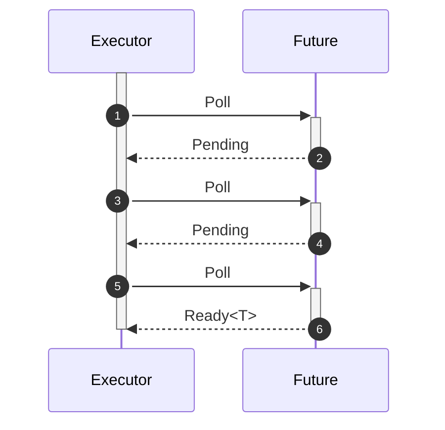
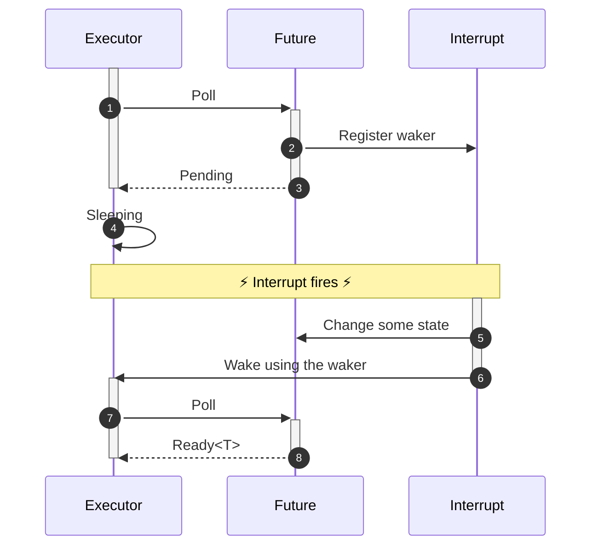

# Rust programming

Module C: Advanced Rust


---
layout: cover
---

# In this module

<!-- Introduce today's subject -->
Dive into advanced Rust topics

---
layout: two-cols
---
# Overview

**Part 1: Parallel Rust**
- Parallelize a program with Rayon
- Work with threads in rust
- Reason about exclusive access
- Implement a basic Mutex

**Part 2: Async Rust**
- Introduction to Rust `async` programming
- The `Future` trait
- `async` and `await`
- `async` runtimes

::right::

**Part 3: Async foundations**
- Uncovering `Future` type
- Mechanics behind `async`/`await`
- Creating our own async primitives

**Part 3: FFI**
- Working with C from Rust and vice versa
- Work with `cargo bindgen`
- Make nice Rust APIs around C libraries

---
layout: cover
---

# Part 1
Parallel Rust

---
layout: center
---


---
layout: default
---
# Concurrency vs. Parallelism

| **Concurrency**                                                                                                          | **Parallelism**                                                                                                                                                        |
| ------------------------------------------------------------------------------------------------------------------------ | ---------------------------------------------------------------------------------------------------------------------------------------------------------------------- |
| Interleaves work                                                                                                         | Parallelizes work                                                                                                                                                      |
| 1 or more cores                                                                                                          | 2 or more cores                                                                                                                                                        |
|  |  |
| Waiting for events                                                                                                       | Waiting for computation                                                                                                                                                |

---
theme: default
class: text-center
highlighter: shiki
lineNumbers: true
info: "Rust - X: Y"
drawings:
  persist: false
fonts:
  mono: Fira Mono
layout: cover
title: 'Rust - X: Y'
---
# Parallelism with Rayon
solving Pleasantly Parallel Problems

---
layout: default
---
# TF–IDF

An algorithm for searching in a big collection of text documents

- term frequency–inverse document frequency
- TF: "how often does a word occur in a particular document"
- IDF: "how rare is the word across all documents"

Problem:

- how do we aggregate the results?


---
layout: default
---
# TF–IDF in Rayon

```rust
use std::collections::HashMap;
use rayon::prelude::*;

fn document_frequency(documents: &[&str]) -> HashMap<&str, usize> {
    documents
        .par_iter()
        .map(|document| term_occurence(document))
        .reduce(HashMap::default, combine_occurences);
}

/// Map each word in the document to the value 1
fn term_occurence(document: &str) -> HashMap<&str, usize> {
    todo!()
}

/// combine the counts from maps a and b.
fn combine_occurences<'a>(
    a: HashMap<&'a str, usize>,
    b: HashMap<&'a str, usize>,
) -> HashMap<&'a str, usize> {
    todo!()
}
```

---
layout: default
---

# Combining results

The `combine_documents` function has several useful properties

- our operation is associative `a • (b • c) = (a • b) • c`
- our operation has a neutral value `HashMap::default()`: `0 • x = x • 0 = x`
- therefore we can split the computation `a • b • c • d = (0 • a • b) • (0 • c • d)`
- an associative operation with a neutral value is called a "monoid"

```rust
// for each word, how often it occurs across all documents
documents
    .par_iter()
    .map(|document| count_words(document))
    .reduce(HashMap::default, combine_documents);
```

- this idea means each thread can start accumulating values

---
layout: default
---
# Intermezzo: Closures

- Closures are anonymous (unnamed) functions
- they can capture ("close over") values in their scope
- they are first-class values

```rust
fn foo() -> impl Fn(i64, i64) -> i64 {
    z = 42;
    |x, y| x + y + z
}

fn bar() -> i64 {
    // construct the closure
    let f = foo();

    // evaluate the closure
    f(1, 2)
}
```

- very useful when working with iterators, `Option` and `Result`.

```rust
let evens: Vec<_> = some_iterator.filter(|x| x % 2 == 0).collect();
```


---
layout: default
---

# So far

- Closures are unnamed inline functions
- Rayon makes data-parallel programming in rust extremely convenient


---
theme: default
class: text-center
highlighter: shiki
lineNumbers: true
info: "Rust - X: Y"
drawings:
  persist: false
fonts:
  mono: Fira Mono
layout: cover
title: 'Rust - X: Y'
---
# Fearless concurrency
thread-based concurrency in rust


---
layout: default
---

# Fearless concurrency

```rust
use std::thread;

fn main() {
    thread::spawn(f);
    thread::spawn(f);

    println!("Hello from the main thread.");
}

fn f() {
    println!("Hello from another thread!");

    let id = thread::current().id();
    println!("This is my thread id: {id:?}");
}
```

- A process can spawn multiple threads of execution. These run concurrently (and may run in parallel)
- Question: what is the output of this program?

---
layout: default
---

# Expected output

maybe

```
Hello from another thread!
This is my thread id: ThreadId(411)
Hello from another thread!
This is my thread id: ThreadId(412)
Hello from the main thread.
```

or

```
Hello from another thread!
Hello from another thread!
This is my thread id: ThreadId(411)
This is my thread id: ThreadId(412)
Hello from the main thread.
```

---
layout: default
---

# Expected output

but most likely

```
Hello from the main thread.
```

The process exits when the main thread is done!


- `.join()` can be used to block the main thread until the child is done

```rust
fn main() {
    let t1 = thread::spawn(f);
    let t2 = thread::spawn(f);

    println!("Hello from the main thread.");

    t1.join().unwrap();
    t2.join().unwrap();
}
```

- `.join()` turns a panic in the thread into an `Err`

---
layout: default
---

# Thread lifetime

- a more typical example

```rust
let numbers = Vec::from_iter(0..=1000);

let t = thread::spawn(move || {
    let len = numbers.len();
    let sum = numbers.iter().sum::<usize>();
    sum / len
});

let average = t.join().unwrap();

println!("average: {average}");
```

- `numbers` must be `move`d into the closure!

---
layout: default
---

# Thread lifetime

- otherwise `numbers` might be dropped while the thread is still using it!

```rust
let numbers = Vec::from_iter(0..=1000);

let t = thread::spawn(|| {
    let len = numbers.len();
    let sum = numbers.iter().sum::<usize>();
    sum / len
});

drop(numbers); // compile error: would create a dangling reference

let average = t.join().unwrap();

println!("average: {average}");
```

---
layout: default
---

# Thread lifetime: make it known

```rust
let numbers = Vec::from_iter(0..=1000);

let average = thread::scope(|spawner| {
    spawner.spawn(|| {
        let len = numbers.len();
        let sum = numbers.iter().sum::<usize>();
        sum / len
    }).join().unwrap()
});

println!("average: {average:?}");
```

- explicitly bound the lifetime with a scope
- threads are always joined at the end of that scope
- makes immutable references just work

---
layout: default
---

- but mutable borrowing rules still apply:

```rust
let mut count = 0;
let counter = &mut count;

std::thread::scope(|s| {
    s.spawn(|| { *counter = *counter + 1; });
    s.spawn(|| { *counter = *counter + 1; });
});
```

```txt
error[E0499]: cannot borrow `*counter` as mutable more than once at a time
6 |     thread::scope(|s| {
  |                    - has type `&'1 Scope<'1, '_>`
7 |         s.spawn(|| { *counter = *counter + 1; });
  |         ----------------------------------------
  |         |       |    |
  |         |       |    first borrow occurs due to use of `*counter` in closure
  |         |       first mutable borrow occurs here
  |         argument requires that `*counter` is borrowed for `'1`
8 |         s.spawn(|| { *counter = *counter + 1; });
  |                 ^^   -------- second borrow occurs due to use of `*counter` in closure
  |                 |
  |                 second mutable borrow occurs here
```

---
layout: default
---

# Race Conditions

- if multiple mutable borrows were allowed, this could happen ...


---
layout: default
---

# Fearless concurrency


- borrowing rules prevent data races & deadlocks
- but also any shared mutable state between threads
- many correct, useful programs are disallowed!

---
layout: default
---

# Re-defining references

- `&T`: (possibly) shared reference
- `&mut T`: exclusive reference


for safe mutation, we need exclusive *access*, which we can get in multiple ways:

- we have an exclusive reference to the value
- we own the value (we can exclusively borrow from ourselves)
- access is inherently exclusive (atomic operations)


---
layout: default
---

# Atomics

- atomic operations are indivisible, but relatively expensive


```rust
use std::sync::atomic::{AtomicU32, Ordering};

let foo = AtomicU32::new(0);
assert_eq!(foo.fetch_add(10, Ordering::SeqCst), 0);
assert_eq!(foo.load(Ordering::SeqCst), 10);
```

- no risk of a race condition: another thread cannot read the value while an atomic operation is ongoing

```rust
pub fn fetch_add(&self, val: u32, order: Ordering) -> u32
```

---
layout: default
---

# Mutual Exclusion

- `Mutex` allows mutation of a `T` through a shared `&Mutex<T>` reference

```rust
use std::sync::Mutex;
use std::thread;

fn main() {
    let n = Mutex::new(String::from("foo"));
    thread::scope(|s| {

        s.spawn(|| { n.lock().unwrap().push_str("bar"); });

        s.spawn(|| { n.lock().unwrap().push_str("baz"); });

    });

    println!("{}", n.into_inner().unwrap());
}
```

- threads lock the mutex, but there is no `unlock` ?!

---
layout: default
---

# Sharing ownership between threads

```rust
impl<T> Mutex<T> {
    pub fn lock<'a>(&'a self) -> LockResult<MutexGuard<'a, T>> {
        ...
    }
}
```

- Acquires a mutex, blocking the current thread until it is able to do so
- Returns a `PoisonError` if a thread panicked while holding the lock
- Returns a `MutexGuard`, proof to the type checker that we hold the lock
- `MutexGuard<'a, T>` implements `DerefMut<Target = T>`, so we can use it like a mutable reference

```rust
impl<'a, T> DerefMut for MutexGuard<'a, T> {
    fn deref_mut(&mut self) -> &mut T {
        // ...
    }
}
```

- dropping the `MutexGuard` unlocks the mutex

---
layout: default
---

# Moving ownership between threads

- Some values should never be shared or moved between threads

The `Send` and `Sync` marker traits enforce this:

```rust
pub unsafe auto trait Send { /* no method */ }
pub unsafe auto trait Sync { /* no method */ }
```

- `Send`: A type is Send if it can be sent to another thread. In other words, if ownership of a value of that type can be transferred to another thread
- `Sync`: A type is Sync if it can be shared with another thread. In other words, a type T is Sync if and only if a shared reference to that type `&T` is Send


---
layout: default
---

# `Send`

- A type is Send if it can be sent to another thread. In other words, if ownership of a value of that type can be transferred to another thread


```rust
impl<T: ?Sized> !Send for MutexGuard<'_, T>
impl<T: ?Sized + Sync> Sync for MutexGuard<'_, T>
```

- On certain OS's, only the thread that locked a mutex may unlock it again!


---
layout: default
---

# MPSC: many producer single consumer

```rust
fn main() {
    let (tx, rx) = std::sync::mpsc::channel();

    std::thread::scope(|s| {
        for (i, tx) in std::iter::repeat(tx).take(10).enumerate() {
            s.spawn(move || { tx.send(i).unwrap(); });
        }

        s.spawn(move || {
            while let Ok(msg) = rx.recv() {
                println!("{msg}");
            }
        });
    });
}
```

where the `Receiver` is:

```rust
impl<T: Send> Send for Receiver<T>
impl<T> !Sync for Receiver<T>
```

---
layout: default
---

# Further reading


- read for free at https://marabos.nl/atomics/

---
layout: default
---

# Summary

- Rayon makes parallel computation easy
- Scoped threads allow borrowing into threads
- Mutation requires exclusive access
- Some data structures guarantee exclusive access (even through a shared reference)
- The borrow checker, `Send` and `Sync` prevent many common problems

---
layout: default
---

# Practice time!
&nbsp;

C1 exercise description: [workshop.tweede.golf](https://workshop.tweede.golf/C1-parallel-rust/mod.html)

---
layout: cover
---

# Part 2
Async Rust

- Introduction to Rust `async` programming
- The `Future` trait
- `async` and `await`
- `async` runtimes

---
layout: default
---
# Concurrency vs. Parallelism

| **Concurrency**                                                                                                          | **Parallelism**                                                                                                                                                        |
| ------------------------------------------------------------------------------------------------------------------------ | ---------------------------------------------------------------------------------------------------------------------------------------------------------------------- |
| Interleaves work                                                                                                         | Parallelizes work                                                                                                                                                      |
| 1 or more cores                                                                                                          | 2 or more cores                                                                                                                                                        |
| Waiting for events                                                                                                       | Waiting for computation                                                                                                                                                |
|  |  |

Today, we're focusing on concurrency: _asynchronous programming_

---
layout: default
---

# What's async?

- Concurrent programming model
- Very suitable for running large number of I/O bound tasks
  - like web servers!
- Look and feel* of synchronous code through `async`/`await` syntax

**Well, not perfectly. We'll get to that*

---
layout: default
---

# Async vs OS Threads

|                      | <span style="color: red">**Async**</span> | <span style="color: blue">**OS Threads**</span> |
| -------------------- | ----------------------------------------- | ----------------------------------------------- |
| Spawning & switching | Cheap                                     | Expensive                                       |
| Blocking is ok       | No                                        | Yes                                             |
| Usage                | I/O bound tasks (web servers)             | CPU-bound tasks (Number crunching)              |
| Reuse sync code      | No                                        | Yes                                             |

[What Color is Your Function? ](https://journal.stuffwithstuff.com/2015/02/01/what-color-is-your-function/)

---
layout: default
---

# What `async` looks like in Rust
To get an idea

```rust
/// An async function
async fn run() -> anyhow::Result<()> {
    /// Await loading and parsing config file
    let config = load_config(CONFIG_PATH).await?;
    /// Await scraping job
    let data = scrape(&config.urls).await?;
    data.report();
    Ok(())
}

fn main() {
    // Set up a `tokio` runtime with default configurations
    let runtime = tokio::runtime::Runtime::new().unwrap();
    // Run a Future to completion
    runtime.block_on(run());
}
```

*Question: What stands out to you? What strikes you as odd?*

---
layout: default
---

# Async in Rust

- Revolve around `Future` trait (~like JS `Promise`, C# `Task`)  
  &rarr; `async fn`s return `Future`s

- `Future`s are inert
- `async` is zero-cost
- No built-in runtime
- Single- or multithreaded execution
- Can be mixed with other concurrency models
- Relatively new and lacks some features and nice diagnostics

---
layout: default
---

# State of the `async` art
What you can expect doing `async` Rust

- Blazingly fast applications
- More interaction with advanced language features
- Compatibility issues (re: colored functions)
- Faster evolving ecosystem
- `async fn` in traits stable since Rust 1.75

*But still a work in progress*

---
layout: default
---

# Support of `async`

- Fundamental types and traits are in `std`
- `async`/`await` are native to the language
- Utilities/extensions in `futures` crate
- Async runtimes are third party

Example runtimes: `async-std`, `tokio`, `smol`
---
layout: section
---
# The `Future` trait
Foundation of async

---
layout: two-cols
---

# A `VerySimpleFuture`
```rust
trait VerySimpleFuture {
    type Output;
    /// Do work and check if task is completed.
    /// Returns [Poll::Ready], containing the 
    /// `Output` if task is ready,
    /// [Poll::Pending] if not
    fn poll(&mut self) -> Poll<Self::Output>;
}

enum Poll<T> {
    Ready(T),
    Pending,
}
```
::right::
<v-click>

```rust
struct VerySimpleAlarm {
    alarm_time: Instant,
}

impl VerySimpleFuture for VerySimpleAlarm {
    type Output = ();

    fn poll(&mut self) -> Poll<()> {
        if Instant::now() >= self.alarm_time {
            Poll::Ready(())
        } else {
            Poll::Pending
        }
    }
}
```
</v-click>

---
layout: two-cols
---

# Executing `VerySimpleFuture`
 ```rust
fn main() {
    let mut first_alarm = VerySimpleAlarm {
        alarm_time: Instant::now() 
            + Duration::from_secs(3)
    };
    let mut snooze_alarm = VerySimpleAlarm {
        alarm_time: Instant::now() 
            + Duration::from_secs(5)
    };

    loop {
        if let Poll::Ready(_) = first_alarm.poll() {
            println!("Beep beep beep");
        }
        if let Poll::Ready(_) = snooze_alarm.poll() {
            println!("You're late for work!")
        }
    }
}
 ```
::right::
<v-click>
<div>

```txt
[pause...]
Beep beep beep
Beep beep beep
[... a few moments later...]
You're late for work!
Beep beep beep
You're late for work!
Beep beep beep
You're late for work!
[...ad infinitum]
```

## It works! 🎉

*Question: How can `VerySimpleFuture` be improved?*
</div>
</v-click>

---
layout: default
---
# Limitation of `VerySimpleAlarm`

- Busy waiting
- How to signal the executor the future is *actually* ready to be polled?

<v-click>
<div>
<br/>

## ⏰ Introduce a Waker

General idea: 
- Run some callback to notify executor
- Have executor implement some job queue
</div>
</v-click>

---
layout: default
---
# A `SimpleFuture`

```rust
trait SimpleFuture {
    type Output;

    fn poll(&self, wake: fn()) -> Poll<Self::Output>;
}

pub struct SocketRead<'a> {
    socket: &'a Socket,
}

impl SimpleFuture for SocketRead<'_> {
    type Output = Vec<u8>;

    fn poll(&mut self, wake: fn()) -> Poll<Self::Output> {
        if self.socket.has_data_to_read() {             // <-- Does syscall
            Poll::Ready(self.socket.read_buf())
        } else {
            self.socket.set_readable_callback(wake);    // <-- Does syscall
            Poll::Pending
        }
    }
}
```

*Adapted from [Asynchronous programming in Rust](https://rust-lang.github.io/async-book/02_execution/02_future.html)*


---
layout: two-cols
---

# Joining `SimpleFuture`s

```rust
pub struct Join<FutureA, FutureB> {
    a: Option<FutureA>,
    b: Option<FutureB>,
}

impl<FutureA, FutureB> SimpleFuture 
    for Join<FutureA, FutureB>
where
    FutureA: SimpleFuture<Output = ()>,
    FutureB: SimpleFuture<Output = ()>,
{
    type Output = ();

```

*Adapted from [Asynchronous programming in Rust](https://rust-lang.github.io/async-book/02_execution/02_future.html)*
::right::
```rust
    fn poll(&mut self, wake: fn()) 
        -> Poll<Self::Output> 
    {
        if let Some(a) = &mut self.a {
            if let Poll::Ready(()) = a.poll(wake) {
                self.a.take(); // Drop future A
            }
        }
        if let Some(b) = &mut self.b {
            if let Poll::Ready(()) = b.poll(wake) {
                self.b.take(); // Drop future B
            }
        }
        if self.a.is_none() && self.b.is_none() {
            Poll::Ready(()) // Both futures dropped
        } else {
            Poll::Pending // A future is pending
        }
    }
}
```


---
layout: default
---
# And then...

```rust
pub struct AndThenFut<FutureA, FutureB> {
    first: Option<FutureA>,
    second: FutureB,
}

impl<FutureA, FutureB> SimpleFuture for AndThenFut<FutureA, FutureB>
where
    FutureA: SimpleFuture<Output = ()>,
    FutureB: SimpleFuture<Output = ()>,
{
    type Output = ();
    fn poll(&mut self, wake: fn()) -> Poll<Self::Output> {
        if let Some(first) = &mut self.first {
            match first.poll(wake) {
                Poll::Ready(()) => self.first.take(),
                Poll::Pending => return Poll::Pending,
            };
        }
        self.second.poll(wake)
    }
}
```

*Adapted from [Asynchronous programming in Rust](https://rust-lang.github.io/async-book/02_execution/02_future.html)*

---
layout: default
---

# `SimpleFuture` takeaways

- Composing `SimpleFuture`s requires no heap allocations
- Composing `SimpleFuture`s requires no deeply nested callbacks

---
layout: default
---

# The `Future` is now!

```rust
pub trait Future {
    type Output;

    fn poll(self: Pin<&mut Self>, cx: &mut Context<'_>) -> Poll<Self::Output>;
}
```

*Question: what stands out to you?*
<v-click>
<div>

- `&mut self` &rarr; `Pin<&mut Self>`: makes `Self` immovable
- `wake: fn()` &rarr; `cx: &mut Context<'_>`: contains a `Waker`

*More on `Pin<&mut Self>` in the [Rust async book](https://rust-lang.github.io/async-book/04_pinning/01_chapter.html)*
</div>
</v-click>

---
layout: cover
---

# `async` and `await`

---
layout: three-slots
---

# Expanding `async`
&nbsp;  

*" `Futures` are cool, but why didn't I see them in the web scraper example?"*

<v-click>
<div>
<br/>

`async fn`s and `async` blocks are syntactic sugar generating `Future`s
```rust
async fn foo() -> u8 { 5 }
```
</div>
</v-click>
::left::
<v-click>
<div>

is equivalent to:
```rust
fn foo() -> impl Future<Output=u8> {
    async {
        5
    }
}
```
</div>
</v-click>
::right::
<v-click>
<div>

which is equivalent to:
```rust
fn foo() -> impl Future<Output=u8> {
    /// Create a future that is immediately ready with a value.
    futures::future::ready(5)
}
```
</div>
</v-click>

---
layout: default
---

# Expanding `async` and `await`

```rust
let fut_one = /* ... */;
let fut_two = /* ... */;
async move {            // <-- generated Future takes ownership of referenced variables
    fut_one.await;
    fut_two.await;
}
```
<v-click>
<div>
Generates an opaque type implementing `Future`:

```rust
struct AsyncFuture {
    fut_one: FutOne,
    fut_two: FutTwo,
    state: State,
}
enum State {
    AwaitingFutOne,
    AwaitingFutTwo,
    Done,
}
```

*This and the following is not the actually generated code, but it's a good mental model*
</div>
</v-click>


---
layout: default
---

# Expanding `async` and `await` (2)

```rust
impl Future for AsyncFuture {
    type Output = ();

    fn poll(mut self: Pin<&mut Self>, cx: &mut Context<'_>) -> Poll<()> {
        loop {
            match self.state {
                State::AwaitingFutOne => match self.fut_one.poll(/* - snip - */) {
                    Poll::Ready(()) => self.state = State::AwaitingFutTwo,
                    Poll::Pending => return Poll::Pending,
                }
                State::AwaitingFutTwo => match self.fut_two.poll(/* - snip - */) {
                    Poll::Ready(()) => self.state = State::Done,
                    Poll::Pending => return Poll::Pending,
                }
                State::Done => return Poll::Ready(()),
            }
        }
    }
}   
```

Kind of looks like `AndThenFut`!

*Adapted from [Asynchronous programming in Rust](https://rust-lang.github.io/async-book/03_async_await/01_chapter.html)*

---
layout: default
---

# `async`/`await` expansion takeaways

- Rust generates state machines out of `async` blocks that implement `Future`
- You can `await` `Future`s
- Every `await` point introduces a new state
- Generated code may become very complex, but original is easy to follow

---
layout: cover
---

# Running `Future`s

---
layout: default
---

# What's an `async` Runtime do?

- Spawn `Future`s
- Keep track of pending `Future`s
- Call `Future::poll` on each `Future` that can make progress
- Poll `Future`s on `Waker::wake` calls

Nice to have:
- Poll `Future`s on multiple threads
- Abstract over I/O

*Crates depending on different runtime I/O abstractions be incompatible!*
---
layout: default
---

# Many Runtime flavors

- [`smol`](https://github.com/smol-rs/smol): Small
- [`async-std`](https://async.rs/): API resembles `std`
- [`tokio`](https://tokio.rs): Very commonly used
- [`embassy`](https://embassy.dev/): Embedded
- Create your own?

*Note: crates may depend on a specific runtime!*

---
layout: default
---

# Showcase: Tokio

```rust
/// Set up a tokio Runtime and spawn the Future returned by `main`
#[tokio::main]
async fn main() {
    do_stuff().await;
}
```

It does stuff!

---
layout: default
---

# A simple TCP server

```rust
use tokio::net::{TcpListener, TcpStream};

/// Read a line, and reply with that line!
async fn handle_connection(socket: TcpStream) -> anyhow::Result<()> {
    let mut stream = BufReader::new(socket);
    let mut name = String::new();
    stream.read_line(&mut name).await?;
    
    stream.write_all(format!("Hello, {name}!").as_bytes()).await?;
    Ok(())
}

#[tokio::main]
async fn main() -> Result<()> {
    let listener = TcpListener::bind("127.0.0.1:6379").await.unwrap();

    loop {
        // The second item contains the IP and port of the new connection.
        let (socket, _) = listener.accept().await.unwrap();
        handle_connection(socket).await?;
    }
}
```

---
layout: default
---
# It works!

```bash
$ echo -e Ferris | nc localhost 6379
Hello Ferris!⏎
```

*Question: But does it scale?*

<v-click>
<div>
Nope! Only one request at a time!
</div>
</v-click>

---
layout: default
---

# Spawning tasks is cheap!
```rust
#[tokio::main]
async fn main() -> Result<()> {
    let listener = TcpListener::bind("127.0.0.1:6379").await.unwrap();

    loop {
        // The second item contains the IP and port of the new connection.
        let (socket, _) = listener.accept().await.unwrap();
        handle_connection(socket).await?;
    }
}
```
becomes:
```rust
async fn main() -> Result<()> {
    loop {
        // The second item contains the IP and port of the new connection.
        let (socket, _) = listener.accept().await.unwrap();
        tokio::task::spawn(async {
            handle_connection(socket).await?;
            Ok::<_, anyhow::Error>(())
        });
    }
}
```

---
layout: cover
---

# Part 3
Async Foundations

- Uncovering `Future` type
- Mechanics behind `async`/`await`
- Creating our own async primitives

---
layout: default
---

# What is async Rust?

Async function:

```rust
use tokio::fs;
use std::net::SocketAddr;

async fn read_address() -> Result<SocketAddr, Box<dyn std::error::Error + 'static>> {
    let contents = fs::read("address.txt").await?;
    let address: SocketAddr = String::from_utf8_lossy(&contents).parse()?;
    Ok(address)
}
```

This is sweet, but can we have less sugar?

```rust
use tokio::fs;
use std::net::SocketAddr;
use std::future::Future;

fn read_address() -> impl Future<Output = Result<SocketAddr, Box<dyn std::error::Error + 'static>>> {
    async {
        let contents = fs::read("address.txt").await?;
        let address: SocketAddr = String::from_utf8_lossy(&contents).parse()?;
        Ok(address)          
    }
}
```

---
layout: two-cols
---

# Async block?

Rust syntax

Instructs the compiler to turn the code block into a state machine

```rust
let my_future = async {
    let a = rand();
    sleep().await;
    let b = a + rand();
    sleep().await;
    let c = (a + b + rand()).to_string();
    sleep().await;
    c
};
```

::right::

Only data carried over await points are kept.
This state machine would roughly look like:

```rust
enum AnonymousFuture {
    Stage0 {
        a: u32
    },
    Stage1 {
        a: u32,
        b: u32,
    }
    Stage2 {
        c: String,
    }
}
```

But how do we interact with the state machine?

---
layout: default
---

# Future

Trait in the std

```rust
pub trait Future {
    type Output;

    fn poll(self: Pin<&mut Self>, cx: &mut Context<'_>) -> Poll<Self::Output>;
}
```

- Async state machines implement `Future`
- A future moves forward by polling
- Keep polling until ready with output

```rust
pub enum Poll<T> {
    Ready(T),
    Pending,
}
```

- `Pin` guarantees `Self` isn't moved
- `poll` should not be called after it has previously returned `Ready`


---
layout: two-cols
---

# Polling a future

- The thing doing the polling is called the executor
- Continuously polling is inefficient
  - CPU needs to stay active
  - Difficult to do something else in the meantime
- What can we improve?

::right::



---
layout: two-cols
---
# Wakers

Wakers are tied to the executor

- Given to poll via the context parameter

```rust {lineNumbers:false}
impl<'a> Context<'a> {
    pub const fn from_waker(waker: &'a Waker) -> Self;
    pub const fn waker(&self) -> &'a Waker;
}
```

- Call the waker's `wake` function to call a function defined in the executor

```rust {lineNumbers:false}
impl Waker {
    pub fn wake(self);
    pub fn wake_by_ref(&self);
    // ...
}
```

- Waker contains a function pointer to the executer

::right::



---
layout: two-cols
---

# Async mutex

Let's build a simple async Mutex using atomics.

*[Playground](https://play.rust-lang.org/?version=stable&mode=debug&edition=2021&gist=709a24c5244b245dc1cb949c37c04901)*

There will be a flaw, can you spot it?

```rust {lineNumbers:false}
use futures::task::AtomicWaker; // <- Very helpful crate

pub struct AsyncMutex<T> {
    /// Contains the value.
    /// UnsafeCell gives us interior mutability.
    inner: UnsafeCell<T>,
    locked: AtomicBool,
    waiter: AtomicWaker,
}

unsafe impl<T: Send> Send for AsyncMutex<T> {}
unsafe impl<T: Send> Sync for AsyncMutex<T> {}
```

::right::

```rust {lineNumbers:false}
impl<T> AsyncMutex<T> {
    pub const fn new(value: T) -> Self {
        Self {
            inner: UnsafeCell::new(value),
            locked: AtomicBool::new(false),
            waiter: AtomicWaker::new(),
        }
    }

    pub async fn lock(&self) -> AsyncMutexGuard<'_, T> {
        AsyncMutexLockFuture { mutex: self }.await
    }
}
```

---
layout: default
---

# Async mutex - lock future

Let's build a simple async Mutex using atomics.

```rust
pub struct AsyncMutexLockFuture<'m, T> {
    mutex: &'m AsyncMutex<T>,
}

impl<'m, T> Future for AsyncMutexLockFuture<'m, T> {
    type Output = AsyncMutexGuard<'m, T>;

    fn poll(self: Pin<&mut Self>, cx: &mut Context<'_>) -> Poll<Self::Output> {
        self.mutex.waiter.register(cx.waker());

        if self
            .mutex
            .locked
            .compare_exchange(false, true, Ordering::AcqRel, Ordering::Acquire)
            .is_ok()
        {
            // We got the mutex
            return Poll::Ready(AsyncMutexGuard { mutex: self.mutex });
        }

        Poll::Pending
    }
}
```

---
layout: two-cols
---

# Async mutex - guard

Let's build a simple async Mutex using atomics.

```rust
pub struct AsyncMutexGuard<'m, T> {
    mutex: &'m AsyncMutex<T>,
}

impl<'m, T> Drop for AsyncMutexGuard<'m, T> {
    fn drop(&mut self) {
        self.mutex.locked.store(
            false,
            Ordering::Release
        );
        self.mutex.waiter.wake();
    }
}
```

::right::

```rust
impl<'m, T> Deref for AsyncMutexGuard<'m, T> {
    type Target = T;

    fn deref(&self) -> &<Self as Deref>::Target {
        // Safety: Only one guard exists
        unsafe { &*self.mutex.inner.get() }
    }
}

impl<'m, T> DerefMut for AsyncMutexGuard<'m, T> {
    fn deref_mut(&mut self)
        -> &mut <Self as Deref>::Target {
        // Safety: Only one guard exists
        unsafe { &mut *self.mutex.inner.get() }
    }
}
```

---
layout: default
---

# Async mutex - use it

That's it!

```rust
static MUTEX: AsyncMutex<u32> = AsyncMutex::new(5);

let mut guard = MUTEX.lock().await;
*guard += 5;
drop(guard);

assert_eq!(*MUTEX.lock().await, 10);
```

Have you spotted the flaw?

<v-click>
<div>

We only have one waker slot, so multiple waiters will bump each other out, which is inefficient.

</div>
</v-click>

---
layout: default
---

# Time for exercises

Let's build an async primitive ourselves!

C2 exercise description: [workshop.tweede.golf](https://workshop.tweede.golf/C2-async-foundations/mod.html)


---
layout: cover
---

# Part 3
Foreign Function Interface

---
layout: default
---
# Q: Why do languages talk with each other?

<v-click>
<div>

- You get an ecosystem for free
- The other language has capabilities (performance, hardware access) that yours doesn't
- You want to gradually introduce a new language in a (large) project
</div>
</v-click>

---
layout: default
---
# Tight langugage coupling

Many languages can use code written in other languages

- JVM: Java, Scala, and Kotlin
- BEAM VM: Erlang and Elixir
- Bare Metal: Zig, D and Nim can import C code

The compiler checks names and types.

---
layout: default
---
# Rust cannot "just" import C code

- Idiomatic C is not idiomatic Rust
- C code cannot provide the guarantees that Rust expects
- Maintaining half of a C compiler is not fun

<v-click>
<div>

Hence, a much looser coupling:

- Generate assembly that is similar to what C generates
- Have the linker stitch everything together
</div>
</v-click>

---
layout: default
---
# Rust & C disagree

- Different memory layout
- Different calling conventions

---
layout: default
---
# Idea: forward-declare the signature

In rust, this function can now be used like any other

```rust
extern "C" {
    fn my_c_function(x: i32) -> bool;
}
```

The linker will stitch this declaration together with the definition

---
layout: default
---
# How to call a function

```rust
extern "C" {
    fn my_c_function(x: i32) -> bool;
}

pub fn main () {
    unsafe { my_c_function(42) };
}
```

generates this code for `main`:

```asm
example::main:
 push   rax                             # free up rax
 mov    edi,0x2a                        # put the argument into the edi register
 call   80b0 <example::my_c_function>   # call `my_c_function`
 pop    rax                             # restore rax
 ret                                    # return
```

---
layout: default
---
# Space vs Speed

Take this example:
```rust
fn foo(vec: Vec<u8>) -> usize { vec.len() }

fn main() { foo(vec![]); }
```
Recall: Vec = pointer + length + capacity

<v-click>
<div>
We can compile this code in two ways

Using 3 registers:

```rust
fn foo(ptr: *const u8, len: usize, cap: usize) -> usize {
    len
}
```

or using one register and indirection:

```rust
fn foo(vec: *const (usize, usize, usize)) -> usize {
    vec.1
}
```

</div>
</v-click>

---
layout: default
---
# Calling convention

- Rust and C make different choices on by-value vs. by-reference
- `extern "C"` forces Rust to use the C calling convention
- The C calling convention is the 'lingua franca' of calling between languages

---
layout: default
---
# C types != Rust types

For some types, Rust and C agree on the representation

```rust
extern "C" {
    // integers
    fn is_even(x: i32) -> bool;

    // pointers
    fn is_null(ptr: *const u32) -> bool;
}


#[repr(u8)]
enum Color { R, G, B }

extern "C" {
    // tag-only enums
    fn circle_with_me(c: Color) -> Color;
}
```

---
layout: default
---
# C types != Rust types

For others, we must explicitly pick the representation

```rust
#[repr(C)]
struct Point { x: f32, y: f32 }

extern "C" {
    // repr(C) structs
    fn h(p: Point) -> bool;
}

#[repr(transparent)]
struct Wrapper<T>(T);

extern "C" {
    // repr(transparent) structs, if the inner type is repr(C)
    fn h(w: Wrapper<u64>) -> bool;
}
```

---
layout: default
---
# C types != Rust types

For others, we must explicitly pick the representation

```rust
#[repr(C)]
union U { int: i64, float: f64 }

extern "C" {
    // repr(C) unions
    fn i(u: U) -> bool;
}
```

---
layout: default
---
# C types != Rust types

- Many types just don't work:
- Enums like `Result` or `Option`
- Owned collections like `String` and `Vec<T>`
- Fat pointers like `&str` or `&[T]`

These need special, manual treatment

---
layout: default
---
# `bindgen`

Generates rust API bindings based on C header files

```rust
extern "C" {
    pub fn crypto_stream_salsa20_tweet_xor(
        arg1: *mut ::std::os::raw::c_uchar,
        arg2: *const ::std::os::raw::c_uchar,
        arg3: ::std::os::raw::c_ulonglong,
        arg4: *const ::std::os::raw::c_uchar,
        arg5: *const ::std::os::raw::c_uchar,
    ) -> ::std::os::raw::c_int;
}
extern "C" {
    pub fn crypto_verify_16_tweet(
        arg1: *const ::std::os::raw::c_uchar,
        arg2: *const ::std::os::raw::c_uchar,
    ) -> ::std::os::raw::c_int;
}
extern "C" {
    pub fn crypto_verify_32_tweet(
        arg1: *const ::std::os::raw::c_uchar,
        arg2: *const ::std::os::raw::c_uchar,
    ) -> ::std::os::raw::c_int;
}
```

---
layout: default
---
# So far

C and Rust don't just work together, we must

- tell rust the name and type of extern functions
- force rust to use the C calling convention
- use only types that have a C-compatible representation
- `bindgen` automates parts of this process

---
layout: default
---
# Using Rust from C

exposed functions look like this

```rust
#[no_mangle]
extern "C" fn sum(ptr: *const u64, len: usize) -> u64 {
    let slice = unsafe { std::slice::from_raw_parts(ptr, len) };

    slice.iter().sum()
}
```

Compiling rust into a static library requires some extra setup in the `Cargo.toml`.

---
layout: default
---

# Practice time!
&nbsp;

C3 exercise description: [workshop.tweede.golf](https://workshop.tweede.golf/C3-ffi/mod.html)

---
layout: section
---

# That's a wrap!

Any further questions?
